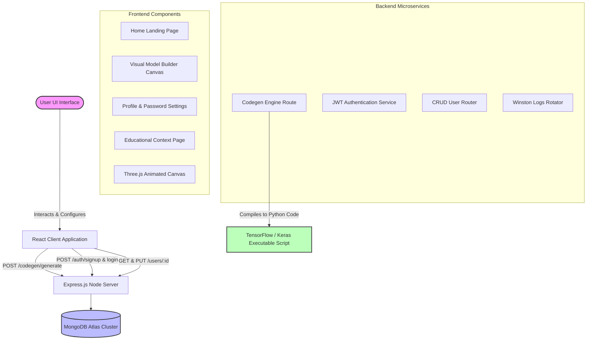

# 🛠️ Deep Learning (DL) Model Builder

[](https://react.dev/)
[](https://vite.dev/)
[](https://nodejs.org/)
[](https://expressjs.com/)
[](https://www.mongodb.com/)
[](https://threejs.org/)
[](https://opensource.org/licenses/ISC)

A premium web-based IDE designed to democratize deep learning by providing an intuitive visual builder for neural network architectures. Users can design architectures via drag-and-drop, configure hyper-parameters in real time, and export production-ready, PEP-8 compliant Python code for TensorFlow/Keras.

---

## 📖 Table of Contents
1. [Key Features](#-key-features)
2. [System Architecture](#%EF%B8%8F-system-architecture)
3. [Project Directory & File Structure](#-project-directory--file-structure)
4. [Technology Stack](#-technology-stack)
5. [Installation & Setup](#-installation--setup)
6. [API Endpoints Reference](#-api-endpoints-reference)
7. [Visual Builder & Layer Reference](#-visual-builder--layer-reference)
8. [Configuration Options Reference](#-configuration-options-reference)
9. [Codegen Engine Deep Dive](#-codegen-engine-deep-dive)
10. [Development Commands](#-development-commands)
11. [Authors & Contribution](#-authors--contribution)
12. [License](#-license)

---

## 🌟 Key Features

### 🎨 Visual Architecture Design
- **Drag-and-Drop Editor**: Build complex architectures by dropping layers (Dense, Convolutional, Activations) directly onto an interactive stack canvas.
- **Dynamic Reordering**: Move layers up or down the network stack dynamically, or delete individual layers instantly.
- **Visual Warnings**: Automated checks warn against bad designs (e.g. consecutive activation functions, invalid parameters, or small screen usage).

### ⚙️ End-to-End Hyper-parameter Tuning
- **Preprocessing Control**: Toggle normalization, standardization, and data augmentation options.
- **Robust Training Settings**: Adjust optimizers (Adam, SGD, RMSprop, Adagrad), learning rates, losses, split ratios, batch sizes, and epoch numbers.
- **Evaluation Settings**: Choose performance metrics, toggle test set evaluation, and configure automatic model saving (.h5 formats).

### 💻 Code Compilation & Export
- **One-Click Code Generation**: Instantly generate clean, formatted, executable Python scripts containing data pipeline setups, model instantiation, training loops, plotting code, saving functions, and inference templates.
- **Secure Exports**: Authentication-guarded exports ensure only logged-in users download code outputs, while public visitors can freely explore the designer.
- **Clipboard Sync**: Instantly copy code blocks to the clipboard for external IDE integration.

---

## 🛠️ System Architecture

The project is structured as a single-page decoupled web application following the MERN (MongoDB, Express, React, Node) design pattern:



---

## 📂 Project Directory & File Structure

Here is a comprehensive index of files in this project. You can click on the file names to inspect their implementations:

```
web_eng_project/
├── backend/                              # Express backend server folder
│   ├── models/
│   │   └── [User.js](file:///D:/GitHub/web_eng_project/backend/models/User.js)                 # Mongoose model for User Profile (includes password hashing)
│   ├── routes/
│   │   ├── [auth.js](file:///D:/GitHub/web_eng_project/backend/routes/auth.js)                 # Authentication endpoints (Sign Up, Login, JWT verification)
│   │   ├── [codegen.js](file:///D:/GitHub/web_eng_project/backend/routes/codegen.js)              # Deep learning model compiler and Python code generator
│   │   └── [users.js](file:///D:/GitHub/web_eng_project/backend/routes/users.js)                # User CRUD and profile updates
│   ├── utils/
│   │   └── [logger.js](file:///D:/GitHub/web_eng_project/backend/utils/logger.js)               # Winston logger utility (logs to console & logs/ directory)
│   ├── [index.js](file:///D:/GitHub/web_eng_project/backend/index.js)                    # Server entrypoint (initializes DB connection and routes)
│   └── [package.json](file:///D:/GitHub/web_eng_project/backend/package.json)                # Backend dependencies & script definitions
│
├── src/                                  # React client frontend folder
│   ├── assets/                           # Static visual resources
│   ├── components/                       # React layout and functional components
│   │   ├── [About.jsx](file:///D:/GitHub/web_eng_project/src/components/About.jsx)               # Educational project background and objective panel
│   │   ├── [About.css](file:///D:/GitHub/web_eng_project/src/components/About.css)               # Styles for the About page
│   │   ├── [BuildModels.jsx](file:///D:/GitHub/web_eng_project/src/components/BuildModels.jsx)         # Drag-and-drop workspace & parameters control panels
│   │   ├── [BuildModels.css](file:///D:/GitHub/web_eng_project/src/components/BuildModels.css)         # Style sheets for the canvas grid layout
│   │   ├── [Home.jsx](file:///D:/GitHub/web_eng_project/src/components/Home.jsx)                # landing page featuring core CTAs and list of use cases
│   │   ├── [Home.css](file:///D:/GitHub/web_eng_project/src/components/Home.css)                # Styles for landing page elements
│   │   ├── [HyperspeedBackground.jsx](file:///D:/GitHub/web_eng_project/src/components/HyperspeedBackground.jsx) # Three.js WebGL particle effect background
│   │   ├── [Navbar.jsx](file:///D:/GitHub/web_eng_project/src/components/Navbar.jsx)              # Top navigation bar component
│   │   ├── [Navbar.css](file:///D:/GitHub/web_eng_project/src/components/Navbar.css)              # Navigation styles
│   │   ├── [Login.jsx](file:///D:/GitHub/web_eng_project/src/components/Login.jsx)               # Authentication login modal
│   │   ├── [Signup.jsx](file:///D:/GitHub/web_eng_project/src/components/Signup.jsx)              # Registration form modal
│   │   ├── [UserSettings.jsx](file:///D:/GitHub/web_eng_project/src/components/UserSettings.jsx)        # User profile information & password management panel
│   │   └── [UserSettings.css](file:///D:/GitHub/web_eng_project/src/components/UserSettings.css)        # Settings styles
│   ├── utils/
│   │   └── [config.jsx](file:///D:/GitHub/web_eng_project/src/utils/config.jsx)                # API environment configurations
│   ├── [App.jsx](file:///D:/GitHub/web_eng_project/src/App.jsx)                         # Client state manager & routing coordinator
│   ├── [App.css](file:///D:/GitHub/web_eng_project/src/App.css)                         # Client global layouts and styling tokens
│   ├── [index.css](file:///D:/GitHub/web_eng_project/src/index.css)                       # Global baseline resets & font pairings
│   └── [main.jsx](file:///D:/GitHub/web_eng_project/src/main.jsx)                        # React app DOM bootstrap injection point
│
├── [index.html](file:///D:/GitHub/web_eng_project/index.html)                          # Entry html point for Vite development
├── [package.json](file:///D:/GitHub/web_eng_project/package.json)                        # Client project dependencies & script definitions
└── [vite.config.js](file:///D:/GitHub/web_eng_project/vite.config.js)                      # Bundler configurations for Vite
```

---

## 💻 Technology Stack

### Client-side (Frontend)
*   **React 19 & DOM**: Framework for reactive web components and unified state-management.
*   **Vite 7**: Rapid hot-reloading development server and rollup asset compiler.
*   **Three.js & Postprocessing**: Renders high-performance interactive 3D WebGL particle space tunnels as a global styling theme backdrop.
*   **Lucide React**: Modern, scalable svg icons library.
*   **Vanilla CSS3**: Tailored styling using customized variables, glassmorphic filters, and keyframe loading animations.

### Server-side (Backend)
*   **Node.js**: Event-driven JavaScript runtime engine.
*   **Express.js 5**: Robust, lightweight routing middleware framework.
*   **Mongoose & MongoDB**: Object-relational mapping (ORM) for data persistence on cloud instances.
*   **JSON Web Tokens (JWT)**: Secure stateless authorization headers.
*   **Bcrypt.js**: One-way salt hashing algorithms for password security.
*   **Winston & Morgan**: Rotational filesystem error logger and standard console server diagnostics tracking.

---

## 🚀 Installation & Setup

Follow these steps to set up the project locally on your machine.

### Prerequisites
Make sure you have the following installed:
*   [Node.js](https://nodejs.org/) (v18.0.0 or higher recommended)
*   [MongoDB](https://www.mongodb.com/try/download/community) (either a local server instance running or a MongoDB Atlas connection string)
*   [Python 3](https://www.python.org/downloads/) (optional, to run generated model scripts locally)

---

### Step 1: Clone the Repository
```bash
git clone https://github.com/Overproness/web_eng_project.git
cd web_eng_project
```

### Step 2: Backend Setup
1. Navigate to the backend directory:
   ```bash
   cd backend
   ```
2. Install the server dependencies:
   ```bash
   npm install
   ```
3. Create a `.env` file in the `backend/` directory:
   ```env
   MONGODB_URI="mongodb://localhost:27017/dl_builder" # Or MongoDB Atlas connection string
   PORT=4000
   JWT_SECRET="use-a-strong-secret-key-here"
   ```
4. Run the server in development mode:
   ```bash
   npm run dev
   ```
   *The server will start running on* `http://localhost:4000`

---

### Step 3: Frontend Setup
1. Return to the root project directory:
   ```bash
   cd ..
   ```
2. Install client dependencies:
   ```bash
   npm install
   ```
3. Configure the environment by creating a `.env` file at the root:
   ```env
   VITE_BACKEND_URL=http://localhost:4000
   ```
4. Start the Vite client application:
   ```bash
   npm run dev
   ```
5. Open your browser and navigate to the local address displayed:
   `http://localhost:5173`

---

## 📡 API Endpoints Reference

All requests and responses use the `application/json` content-type.

### 🔑 Authentication (`/auth`)

| Method | Endpoint | Description | Request Body | Response Success (200/201) |
| :--- | :--- | :--- | :--- | :--- |
| **POST** | `/auth/signup` | Register a new user profile | `{name, email, password}` | `{message, token, user: {id, name, email}}` |
| **POST** | `/auth/login` | Login and acquire authentication token | `{email, password}` | `{message, token, user: {id, name, email}}` |
| **GET** | `/auth/me` | Fetch active profile (JWT Required) | *Empty (Authorization Header)* | `{id, name, email}` |

### 🧠 Code Generator (`/codegen`)

| Method | Endpoint | Description | Request Body | Response Success (200) |
| :--- | :--- | :--- | :--- | :--- |
| **POST** | `/codegen/generate` | Compiles architecture configurations into Python script | `{layers, inputConfig, trainingConfig, outputConfig}` | `{success, code: string, message}` |

### 👥 User CRUD (`/users`)

| Method | Endpoint | Description | Request Body | Response Success (200) |
| :--- | :--- | :--- | :--- | :--- |
| **POST** | `/users/` | Create a user manually (admin helper) | `{name, email, password}` | User instance JSON |
| **GET** | `/users/` | Read all registered users | *Empty* | List of all users (JSON) |
| **GET** | `/users/:id` | Get details for single user | *Empty* | User profile JSON |
| **PUT** | `/users/:id` | Update user properties | `{name, email, ...}` | Updated user profile JSON |
| **DELETE** | `/users/:id` | Delete user profile | *Empty* | `{message: "Deleted"}` |

---

## 🧱 Visual Builder & Layer Reference

These are the pre-built layer objects available within the palette. They can be dragged onto the main stack.

| Layer Type | Default Parameter Attributes | Keras Equivalent | Typical Use Cases |
| :--- | :--- | :--- | :--- |
| **Input** | `shape: "28, 28, 1"` | `layers.Input` | First layer of every model to define the dimensions of raw incoming features. |
| **Dense** | `units: 128`<br>`activation: "relu"` | `layers.Dense` | Fully connected layers mapping activations from previous layer to classification tags. |
| **Conv2D** | `filters: 32`<br>`kernelSize: 3`<br>`activation: "relu"`<br>`padding: "same"` | `layers.Conv2D` | Convolutional layer extraction (edges, patterns) in image analysis pipelines. |
| **MaxPooling2D** | `poolSize: 2`<br>`strides: 2` | `layers.MaxPooling2D` | Dimensionality reduction, capturing dominant features in spatial maps. |
| **AvgPooling2D** | `poolSize: 2`<br>`strides: 2` | `layers.AveragePooling2D` | Alternative spatial downsampling smoothing out activation transitions. |
| **SeparableConv2D**| `filters: 64`<br>`kernelSize: 3`<br>`activation: "relu"` | `layers.SeparableConv2D` | Depthwise separable convolutions reducing computational weight. |
| **Flatten** | *None* | `layers.Flatten` | Unrolls multi-dimensional tensor arrays into a flat 1D vector before entering Dense classification zones. |
| **Dropout** | `rate: 0.5` | `layers.Dropout` | Drops nodes during training steps to prevent overfitting. |
| **BatchNormalization**| *None* | `layers.BatchNormalization` | Normalizes inputs of preceding layers to stabilize and accelerate convergence. |
| **ReLU** | `max_value: null` | `layers.ReLU` | Non-linear Rectified Linear Unit activation threshold mapping. |
| **Softmax** | *None* | `layers.Softmax` | Translates activations into probability arrays summing to 1. |
| **Sigmoid** | *None* | `layers.Activation('sigmoid')`| Maps inputs between 0 and 1, used for binary classification outputs. |
| **Tanh** | *None* | `layers.Activation('tanh')` | Maps inputs between -1 and 1, for zero-centered activations. |
| **LeakyReLU** | `alpha: 0.3` | `layers.LeakyReLU` | Variants of ReLU that retain minor gradients when input is negative. |
| **GlobalAveragePooling2D** | *None* | `layers.GlobalAveragePooling2D`| Calculates average of each channel feature map in CNN heads. |
| **GlobalMaxPooling2D** | *None* | `layers.GlobalMaxPooling2D` | Calculates maximum of each channel feature map. |

---

## ⚙️ Configuration Options Reference

These parameters sit inside the right config panel and guide the compilation engine.

### 📥 1. Input Config
*   **Input Shape**: The input shape dimension strings separated by commas (e.g. `28, 28, 1` for image datasets or `20` for single vector lists).
*   **Data Preprocessing**:
    *   `normalize`: Scales inputs to floats between `0.0` and `1.0`.
    *   `standardize`: Normalizes distribution (`mean = 0`, `std = 1`).
    *   `none`: Passes raw values straight to the input node.
*   **Data Augmentation**: When enabled, appends sequential random flip, zoom (0.1), and rotation (0.1) layers immediately after the input layer.

### 🏋️ 2. Training Config
*   **Train/Test Split**: Defines the ratio of data allocated for training steps versus testing evaluations (default `0.8`).
*   **Validation Split**: Defines the validation sub-dataset partition size from the training dataset (default `0.2`).
*   **Epochs**: Number of full training iterations over the whole dataset (default `10`).
*   **Batch Size**: Samples processed before internal variables are updated (default `32`).
*   **Optimizer**: Choose optimization algorithms (`adam`, `sgd`, `rmsprop`, `adagrad`).
*   **Learning Rate**: Optimization step size parameter (default `0.001`).
*   **Loss Function**: Targets training convergence calculations (e.g. `categorical_crossentropy` for multi-class classifiers, `binary_crossentropy` for binaries, or `mean_squared_error` for regression lines).

### 📤 3. Output Config
*   **Metrics**: Metric arrays to compute during runs (e.g., `["accuracy"]`).
*   **Evaluate on Test Set**: Performs final checks using the held-back test partition.
*   **Save Model**: Compiles save instructions writing output files to disk.
*   **Model Name**: Target filename string for the saved model structure (e.g. `my_model.h5`).

---

## 🧠 Codegen Engine Deep Dive

The core feature of this platform resides in [codegen.js](file:///D:/GitHub/web_eng_project/backend/routes/codegen.js). The engine executes code compilation dynamically based on user-supplied configurations.

### Code Compilation Lifecycle
1.  **Dependency Resolver**: The route evaluates if auxiliary libraries are needed (e.g., `scikit-learn` for data splitting or `matplotlib` for generating charts). It generates standard terminal instruction headers detailing `pip install` commands.
2.  **Imports Setup**: Dynamically lists and appends modules (`tensorflow`, `numpy`, `matplotlib`, `sklearn`) depending on options selected.
3.  **Pipeline Compilation**: Appends dataset simulation scripts (MNIST templates as standard) and translates preprocessing configuration selectors into numpy/tensorflow normalization statements.
4.  **Sequential vs. Custom Models**:
    *   If **Augmentation** is enabled, it generates a custom inputs object `layers.Input(...)`, wraps it with augmentation layers (`RandomFlip`, `RandomRotation`), loops over remaining items, and links them sequentially: `x = layers.Dense(128)(x)`. It compiles it using the functional API: `model = keras.Model(inputs=inputs, outputs=x)`.
    *   If **Augmentation** is disabled, it constructs a cleaner `keras.Sequential([...])` array block containing all layers.
5.  **Compile & fit Blocks**: Formulates `model.compile(...)` using optimizer instances configured with custom learning rates.
6.  **Training & Output Visualization**: Adds training history loops, plots training curves with matplotlib, and appends code to save files.

---

## 💻 Development Commands

These npm script actions are configured in the workspaces:

### Frontend Workspace
In the root directory:
```bash
npm run dev      # Spin up Vite client development server (hot-reload)
npm run build    # Compiles optimization build to /dist for production deployment
npm run preview  # Spin up local preview of built production scripts
npm run lint     # Perform code quality inspection using ESLint
```

### Backend Workspace
In the `backend/` directory:
```bash
npm start        # Launch node index.js server
npm run dev      # Launch backend server via Nodemon for live reloads on change
```

---

## 👥 Authors & Contribution

DL Model Builder was designed, built, and polished by the following core team:
*   **Muntazar**
*   **Abubakar**
*   **Muhammad Ahmad**

Contributions are welcome! Please fork the repository, make changes in a feature branch, and submit a pull request for review.

---

## 📄 License

This repository is distributed under the terms of the **ISC License**. For more information, please read [package.json](file:///D:/GitHub/web_eng_project/package.json).

*Developed as part of a Web Engineering project to simplify visual deep learning workflows.*
